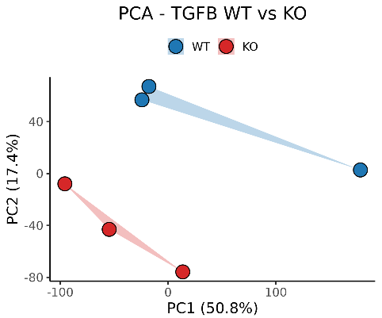

# Shiny Adjustable PCA Plot for Proteomics Data

## Overview 
This repository contains a Shiny application for interactive Principal Component Analysis (PCA) of proteomics data. It includes:

- **Dynamic filtering** and **normalization** of proteomics datasets.
- Customizable **PCA visualization** with adjustable parameters.
- A user-friendly interface for **data exploration** and analysis.

The application is containerized using Docker, ensuring a seamless setup and execution environment.

---

## Features
- **PCA Plot Customization**:
  - Select normalization method (Voom or Log CPM).
  - Adjust minimum expression thresholds.
  - Filter low-variance genes interactively.
  - Dynamic PCA visualization with explained variance.

- **Proteomics Dataset Integration**:
  - Input: `proteomics_counts.csv`.
  - Preprocessing includes handling missing values, normalization, and variance filtering.

- **Interactive Shiny Application**:
  - Intuitive UI with real-time PCA updates.
  - Clear and customizable visualization.

---

## Prerequisites
### Software
- R (≥ 4.0.0)
- Docker (for containerized deployment)
- Git (for repository cloning)

### R Packages
- `shiny`
- `ggplot2`
- `ggrepel`
- `limma`
- `edgeR`

---

## Installation and Usage
### Using Docker
1. Clone the repository:
   ```bash
   git clone https://github.com/carlosbuss1/SHINY_Adjustable_PCA_plot_4_Proteomics.git
   cd SHINY_Adjustable_PCA_plot_4_Proteomics
   ```
2. Build the Docker image:
   ```bash
   docker build -t shiny-pca-app .
   ```
3. Run the container:
   ```bash
   docker run -p 3838:3838 shiny-pca-app
   ```
4. Access the application in your browser at:
   ```
http://localhost:3838
   ```

### Running Locally
1. Install the required R packages:
   ```r
   install.packages(c("shiny", "ggplot2", "ggrepel", "limma", "edgeR"))
   ```
2. Open the `shiny_pca_plot.R` script in RStudio or your preferred IDE.
3. Run the application:
   ```r
   shiny::runApp()
   ```

---

## Files in This Repository
- `shiny_pca_plot.R`: Shiny application script.
- `Dockerfile`: Dockerfile for containerizing the application.
- `proteomics_counts.csv`: Example dataset for testing the application.

---

## Example
Below is a snapshot of the PCA plot generated by the application:
 *(Replace with your actual plot)*

---

## Contributing
Contributions are welcome! Feel free to fork this repository, make changes, and submit a pull request.

---

## Contact
**Carlos Buss**  
GitHub: [carlosbuss1](https://github.com/carlosbuss1)
